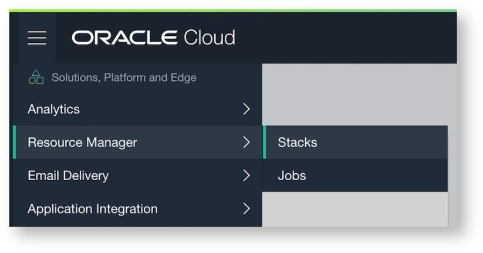
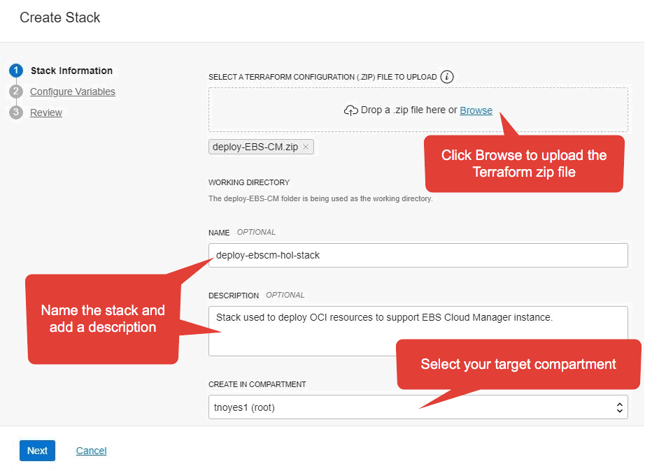
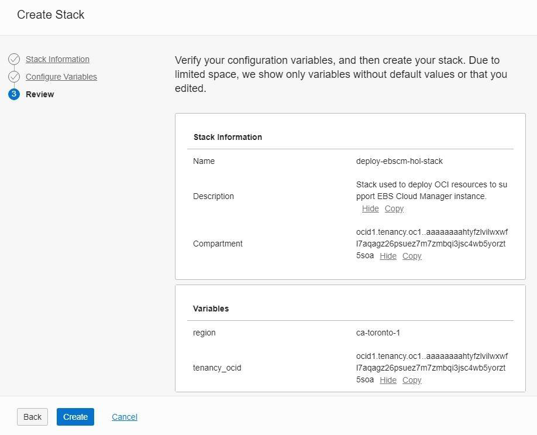
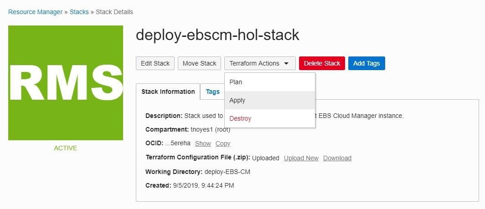

# Lab 100: Preparing Your Tenancy for Oracle E-Business Suite

## Introduction
In this exercise, you will prepare your tenancy for Oracle E-Business Suite.

## Part 1. Sign Up for a Trial Account
Step 1: 
1. From your laptop, go to oracle.com/cloud/free and click “Start for free”.

2. On the Oracle Cloud Sign Up page, enter the requested information including your desired tenancy name and tenancy password.

3. Review your details and click Submit.

```
Note: Ensure that you use the same email address used when you registered.
```

You will be directed to the Oracle Cloud Infrastructure console where you will execute the remainder of the lab.


## Part 2. Record User Details

1. Record your trial user name and password to Tenancy_Admin_User and Tenancy_Admin_Password in your Key-Data.txt file.

## Part 3. Create Oracle Cloud Infrastructure Resources

You will now run a Terraform Script which will create the resources required to deploy the Oracle E-Business Suite Cloud Manager, including:

• A compartment
• Group, policies, and a user
• Network resources – including a VCN, an internet gateway, subnets, route tables, security lists, and security rules

1. In the Oracle Cloud Infrastructure console navigation menu, select Resource Manager and then click Stacks.



2. In the COMPARTMENT drop-down list on the left side of your screen, select your root compartment.


3. Click Create Stack.


4. In the Create Stack dialog box:
a. Click the Browse link to upload the Terraform zip file (found at Desktop/HOL-EBS/artifacts/terraform/deploy-EBS-CM.zip).
b. Enter deploy-ebscm-hol-stack in the NAME field.
c. Enter a description.
d. Verify the target compartment (and change if necessary).
e. Click Next.



5. On the Configure Variables screen, verify the region and tenancy OCID and then click Next.


6. On the Review screen, verify the information and click Create.



7. This takes you to the Stack Details page for your newly created stack. On this page, click the Terraform Actions drop-down list and select Apply.



8. In the Apply dialog window, leave the default settings as-is and click Apply.


9. On the Job Details page, you will see the job status which will cycle through Accepted, In Progress, and Succeeded.


After the job succeeds, you will have all the network resources (VCN, load balancer, subnets, and so on) required to deploy the Oracle E-Business Suite Cloud Manager Compute instance.

10. On the Job Details page under Resources, click Logs, and scroll through towards the end of the log to “Outputs”.


11. Copy and paste the keys and key values below Outputs into the Outputs section of your Key-Data.txt. These variables are needed for the remainder of the procedures in this lab.

You have now finished Exercise 1. Please wait for the instructor before proceeding with the next exercise.


