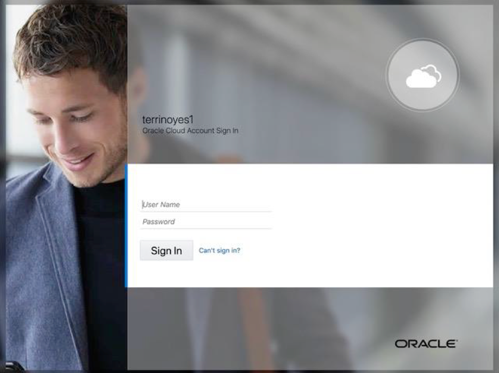

# Lab 300: Provision Your Oracle E-Business Suite Environment

## Introduction
In this portion of the lab you will use the one-click provisioning feature of the Oracle E-Business Suite cloud manager to provision an Oracle E-Business suite environment.

## Part 1. Log in to EBS Cloud Manager
1. Navigate to your Oracle E-Business Suite Cloud Manager application using the Login URL recorded in your Key-Data.txt file. Log in with your Oracle Identity Cloud Service Credentials.



2. On the Oracle EBS Cloud Manager environments page click provision environment and select "One-Click." Enter the following details for your environment:
* **Environment Name:** ebsholenv1
* **Purpose:** Vision Demo Install
* **EBS Version:** 12.2.9
* **DB Version:** 12.1.0.2

3. Click Submit

You can check the status of the activity to provision the environment in the Activities page. The provisioning process will take approximately 20-25 minutes.

## Part 2. Enable and Set Oracle EBS Account Passwords
1. SSH to the newly created environment by following the instructions under “Administrator Access” in section “Access Your Oracle E-Business Suite Environment” in the Oracle by Example tutorial: [Performing Post-Provisioning and Post-Cloning Tasks for Oracle E-Business Suite on Oracle Cloud Infrastructure](https://www.oracle.com/webfolder/technetwork/tutorials/obe/cloud/compute-iaas/post_provisioning_tasks_for_ebs_on_oci/110_post_prov_cm_oci.html)

2. As the ```oracle``` user, set the environment using the following command:
```
$ . /u01/install/APPS/EBSapps.env run
```

3. To log in through the web interface, you must initially set a password of your choice for the `SYSADMIN` user. After the `SYSADMIN` user is active with the new password, you can create new users or activate existing locked users. To enable the `SYSADMIN` user, run the following commands:
```
$ mkdir -p ~/logs
$ cd ~/logs
$ sh /u01/install/APPS/scripts/enableSYSADMIN.sh
```
When prompted, enter a new password for the `SYSADMIN` user.
The `SYSADMIN` user can now connect to Oracle E-Business Suite through the web interface and create new users or activate existing locked users.

4. For this Vision demo environment, you can run another script to unlock a set of 36 application users that are typically used when demonstrating Oracle E-Business Suite using the Vision database.
```
$ cd ~/logs
$ sh /u01/install/APPS/scripts/enableDEMOusers.sh
```
When prompted, enter a new password (using a special character is highly encouraged).
Do not run this script on a fresh or production environment.
