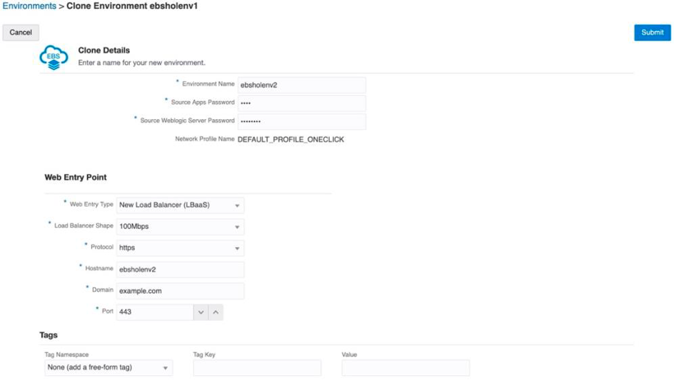

# Lab 400: Clone Your Oracle E-Business Suite Environment

## Introduction
Use the Cloning feature of Oracle E-Business Suite Cloud Manager to clone your Oracle E-Business Suite environment.

## Part 1. Access the Clone Environment Page
1. Navigate to the Cloud Manager Environments page.
2. For ebsholenv1, click Action and select Clone. Enter Details (see screenshot and points below)


3. Enter the following values for the clone details:<br>
  * Environment Name: ebsholenv2
  * Source Apps Password: apps
  * Source WebLogic Server password: welcome1
4. Choose Load Balancer as a Service (LBaaS) by selecting the Deploy New Load Balancer check box.
5. Then, you must also select a shape in the Load Balancer Shape field. Select 100 mbps
6. Enter these values for the following Web Entry properties.
  * Protocol: https
  * Domain: example.com
  * Port: 443
  * Web Access IP/CIDR: 0.0.0.0/0
7. Click Submit.
8. You can check the status of the activity to clone the environment in the Activities page. The new environment is listed on the Environments page.

## Part 2. Configure Local Host Files for the Cloned Environment and Log in to Oracle E-Business Suite

1. In the Oracle Cloud Infrastructure console, find the IP address for the Oracle E-Business Suite web entry point by navigating to Networking > Load Balancers.

2. On the Load Balancers page, you will find a load balancer named ebsholenv2-lbaas. Obtain the public IP address of this load balancer and record in your ```Key-Data.txt``` file.

3. Edit the local hosts file on your laptop and add an entry.
